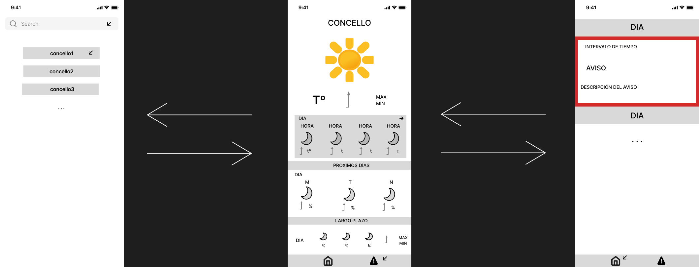

# Diseño

El diseño de la aplicación debe incluir:

- Una lista de búsqueda sobre los distintos concellos.
- Una vista de la predicción del tiempo clara.
- La posibilidad de ver los distintos tipos de avisos meteorológicos de cada concello.

## Navegación

